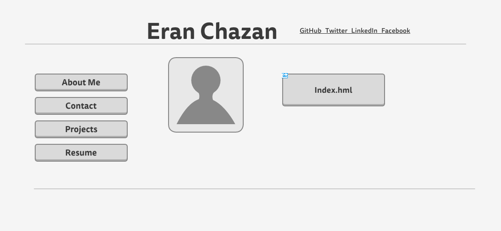
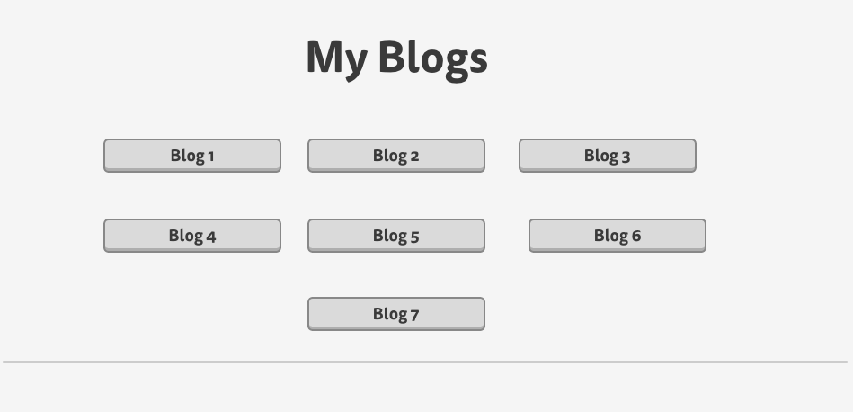

What is a wireframe?
A wireframe is a screen blueprint or page schematic for the skeletal framework of a website.  

What are the benefits of wireframing?
Wireframes allows you to see the visual arrangement of your elements before you spend the hard work of coding them into your website. It allows you to experimemt with different design choices to best fit your webpage objectives. 

Did you enjoy wireframing your site?
I enjoyed wireframing my site because it allowed me to iterate my design process to finally make the webpage look like the vision I had in my head. It allowed me to experiment with different design styles and configurations. 

Did you revise your wireframe or stick with your first idea?
I revised my wireframe sevearl times. First becasue I read the instructions wrong, and a several other times to improve on the spatial layout of my elements boxes. 

What questions did you ask during this challenge? What resources did you find to help you answer them?
Some questions I asked during the challenge was what exactly is a header, footer, and navagation bar. I got the answers to these questions by reading the "Beginner's Guide to Wireframing"

Which parts of the challenge did you enjoy and which parts did you find tedious
The part of the challenge I enjoyed most was studying the elegant wireframe schematics. What I found tedious was taking all those ideas and deciding what I personally wanted to do in the end. There's an infinite amout of possiblities in deciding how your wireframe will look, and deciding what I wanted to finally stick with was a challenge.  
