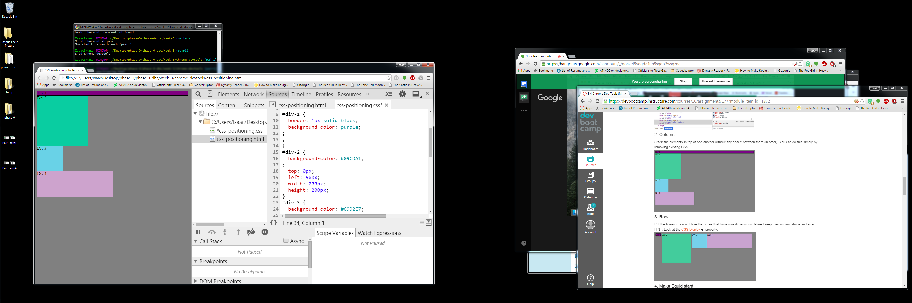
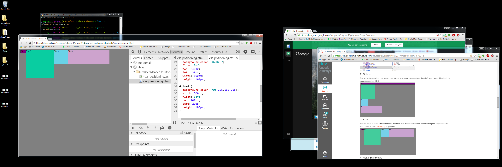
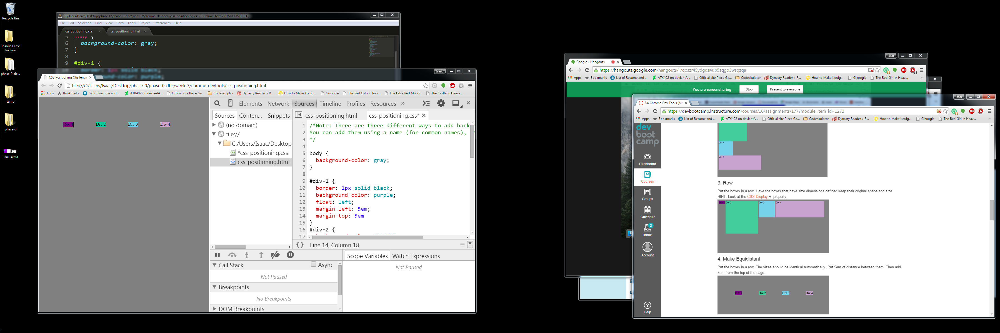
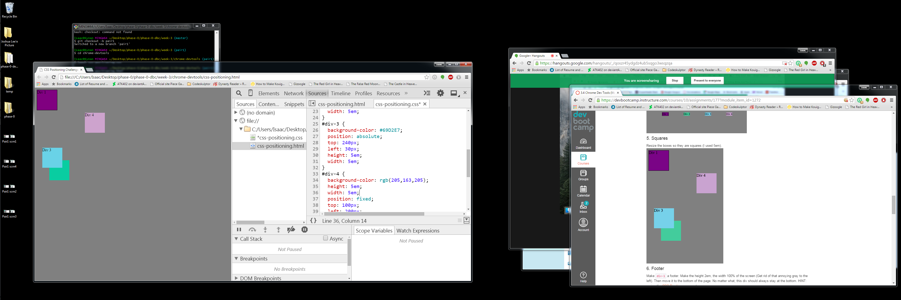
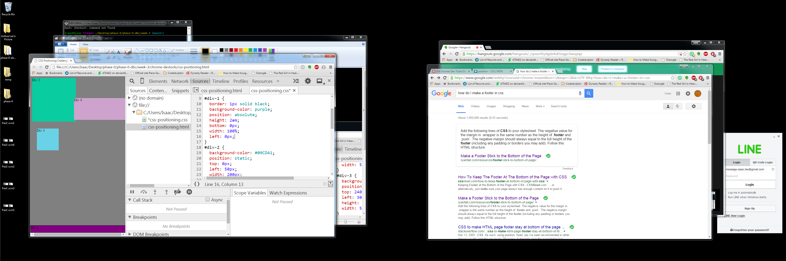
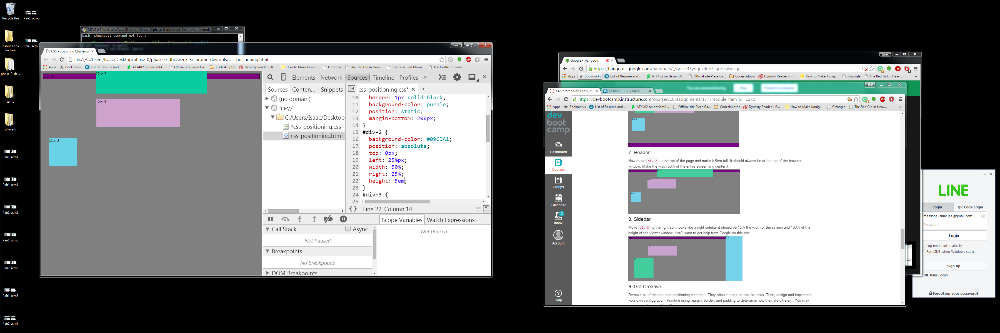
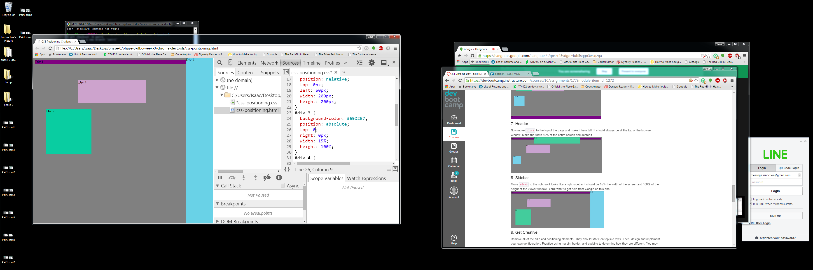
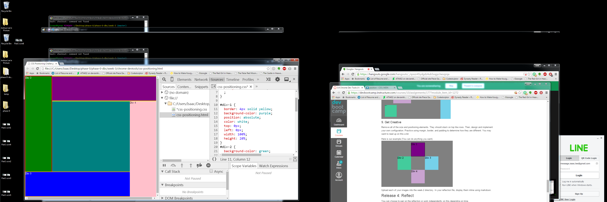

<!DOCTYPE html>
<html>
	
	
	
	
	
	
	
	
	

How can you use Chrome's DevTools inspector to help you format or position elements?
The inspector is basically a real time styling dashboard that gives me the source code of each element graphically displayed in the browser. I can go in and change the source code of position elements and the browser will be updated instantaneously. 

How can you resize elements on the DOM using CSS?
To resize elements using CSS I used the element height and width keys and corresponding values in pixel or em. You can also type in the percent of space an element takes up in a row or column in the document thereby declaring size. 

What are the differences between Absolute, Fixed, Static, and Relative positioning? 
Absolute positioning is when the element is positioned in relation to the first parent element it has, if it has no parent then element gets positioned relative to html. Fixed positioning anchors an element to the browser window. Static positioning is when you don't specify an element's positioning type and the element has normal behavior. Relative positioning lays out all elements as though the element were not positioned and then adjust the element's position.  

Which did you find easiest to use? Which was most difficult?
The easist thing to use was setting element shape and size. The most difficult to use was positioning since it relies on external factors for its affects. 

What are the differences between Margin, Border, and Padding?
Margin is the space around the element. The larger the margin, the more space between the element and the elements around it. Border is the edge of the element. It's what we've been making visible every time we set the border property. Padding is the spacing between the contenet and the border. 

What was your impression of this challenge overall? (love, hate, and why?)
My impression of this challenge was that it was a crashcourse into css document styling that will take time to learn. It takes practice and experience to learn how each styling method interacts each other and the browser. 

